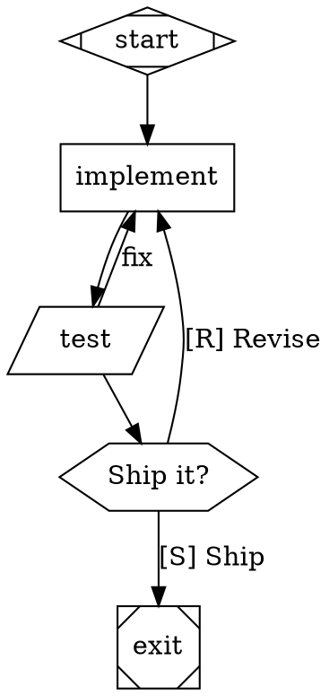

# Fabro Workflow Author

Turn a plain-English process description into a validated `.fabro` workflow.

## Procedure

1. **Extract the process**: list the steps, which are agent work vs. shell commands
   vs. human decisions, where loops occur (implement → test → fix), and what "done" means.
2. **Write the graph** (see language reference below). One `start`, one `exit`,
   every step a node, every loop an explicit back-edge with a condition.
3. **Validate**: `fabro validate <file>.fabro` — fix until clean.
4. **Render**: `fabro graph <file>.fabro -o <file>.svg` and eyeball the shape.
5. **Dry-run**: `fabro run <file>.fabro --dry-run` (simulated LLM backend) before a real run.

When writing a PR or doc that shows a workflow, include a Mermaid rendering —
via `bin/dot2mermaid <file>.fabro` if this repo's converter is available,
otherwise by hand (nodes/edges map 1:1; pick the nearest Mermaid shape).

Prefer deterministic verification (command nodes running tests/linters) over
LLM judgment wherever possible — that's what makes a factory "dark".

## Language reference (compact)

Every workflow is a Graphviz `digraph` with exactly one start node
(`shape=Mdiamond`) and one exit node (`shape=Msquare`). Node shape selects the handler:

| Shape | Handler | Role |
|---|---|---|
| `box` | agent | Multi-turn LLM with tools |
| `tab` | prompt | Single LLM call, no tools |
| `parallelogram` | command | Shell/Python (`script`, `language`) |
| `hexagon` | human | Decision gate (`question_type`: yes_no/multiple_choice/freeform) |
| `diamond` | conditional | Route on edge conditions |
| `component` | parallel | Fan-out (`join_policy`: wait_all/first_success, `max_parallel`) |
| `tripleoctagon` | parallel.fan_in | Merge results |
| `insulator` | wait | Pause (`duration="30s"`) |
| `house` | sub-workflow | Nested workflow |

Common node attributes: `label`, `prompt` (or `prompt="@path/file.md"`), `model`,
`timeout`, `max_retries`, `retry_target`, `output_schema="@schemas/x.json"`.

Edges route on conditions:

```dot
validate -> exit    [condition="outcome=succeeded"]
validate -> fix     [condition="outcome=failed && context.attempts < 3"]
```

Operators: `=`, `!=`, `>`, `<`, `>=`, `<=`, `contains`, `matches`, `&&`, `||`, `!`.

Graph-level config: `graph [goal="...", model_stylesheet="...", default_max_retries=2]`.
Model stylesheets route nodes to models CSS-style, with fallback chains.

Minimal example:



Human gates route by edge *labels*: the option the human picks becomes
`preferred_label` and matches the edge with that label. `[S]`/`[R]` prefixes
are keyboard accelerators. Conditional edges take priority; an unconditional
edge is the default fallback.

## Deep reference

Read the full docs before using features not covered above. A `fabro-docs/`
mirror ships alongside this skill (at the repo/plugin root, two directories up
from this file); read it locally, or fetch from docs.fabro.sh if absent.

The mirror is a snapshot and may be stale — plugin installs are cached clones.
For anything version-sensitive (the changelog, a feature not covered here, or
when observed `fabro` behavior disagrees with the local docs), fetch the live
page from docs.fabro.sh instead: same paths as below, index at
`https://docs.fabro.sh/llms.txt`.

- `fabro-docs/reference/dot-language.md` — full language spec
- `fabro-docs/workflows/*.md` — transitions, variables, imports, stylesheets, human gates
- `fabro-docs/execution/*.md` — checkpoints, failures, outcomes, run configuration
- `fabro-docs/tutorials/*.md` — worked examples (branch/loop, ensemble, parallel review)
- `fabro-docs/reference/cli.md` — full CLI reference
